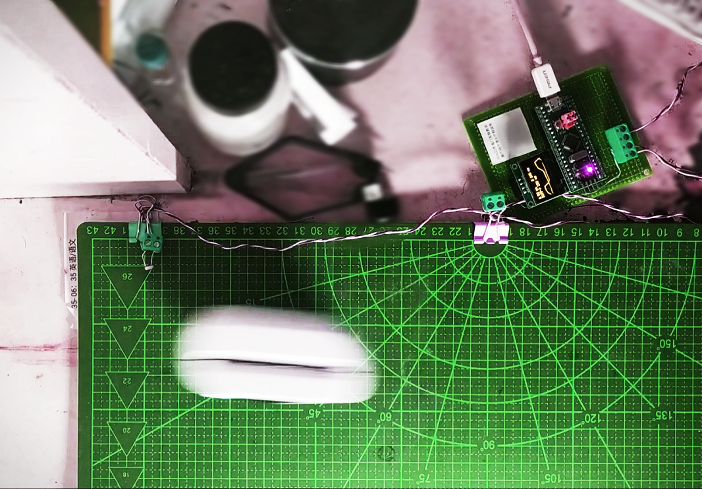
在这次实验，我们使用STM32单片机和由两个光敏电阻以及平行光源组组成的A和B两个光电门来计算运动物体的加速度，物体通过两个光敏电阻时会遮挡平行光，此时stm32单片机会记录下两个光敏电阻上的电位变化通过串口通讯把波形上传到计算机以待进一步分析，并且在STM32的OLED显示屏上显示出两个光敏电阻的遮光时间以及通过两个光敏电阻之间的时间差。
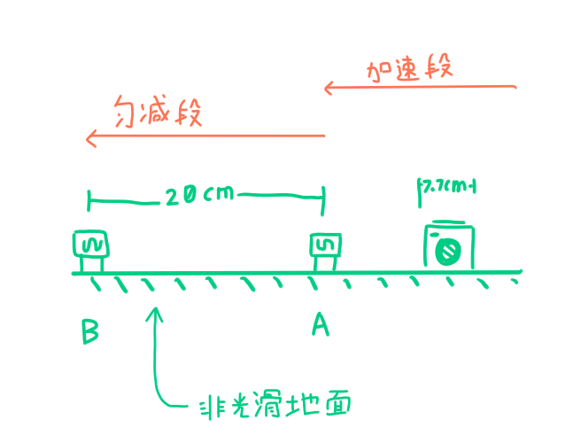
上图为为实验具体示意图，现在有一遮光长度为7.7CM的热敏打印机，我们对其进行加速直到打印机进入光电门A，计算机记录下第一个遮光时间t1，待热敏打印机通过光电门B时，计算机会记录下通过离开光电门A后直到进入光电门B的时间差t2，最后热敏打印机离开光电门B，计算机最后记录下第二个遮光时间t3。热敏打印机进入光电门A后受到摩檫力作匀减速运动，利用热敏打印机遮光长度7.7CM组合t1和t3可以计算出通过光电门A、B的速度V1和V2,最后利用时间差t3可以计算出热敏打印机作匀减运动的加速度！
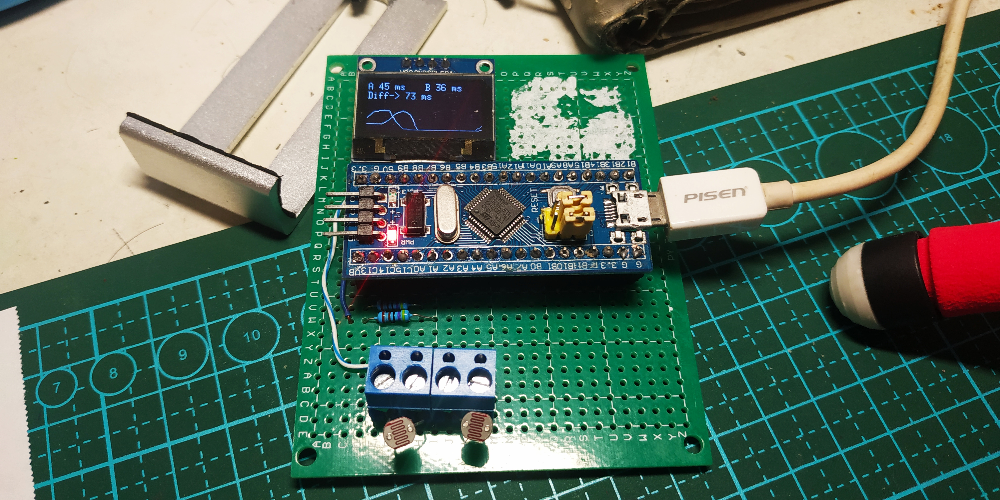
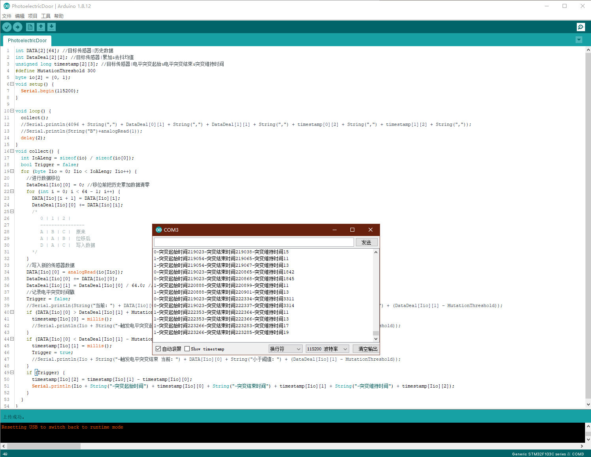
为了方便在大屏幕上进行演示，我还制作了上位机软件，根据STM32通过串口通讯上传的波形数据以及处理好的时间数据对加速度进行计算
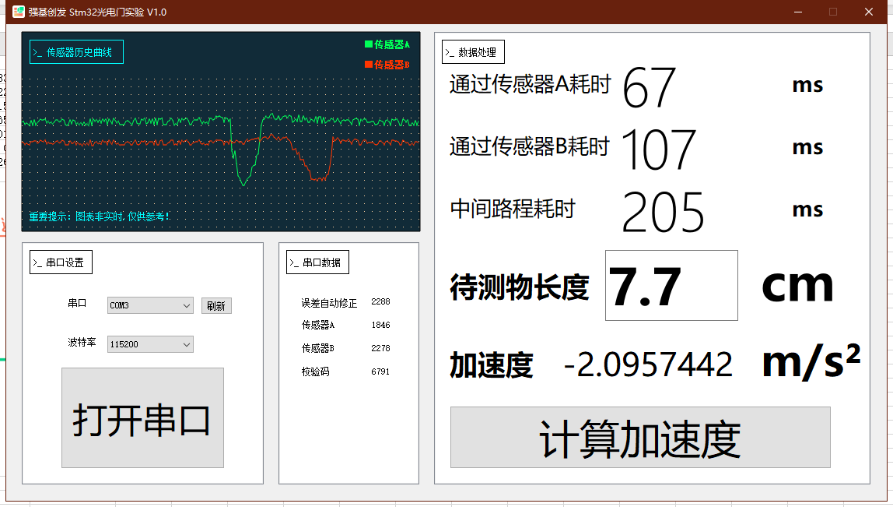
我们再重复进行多次实验，去除最高和最低的数据，得出这张加速度表
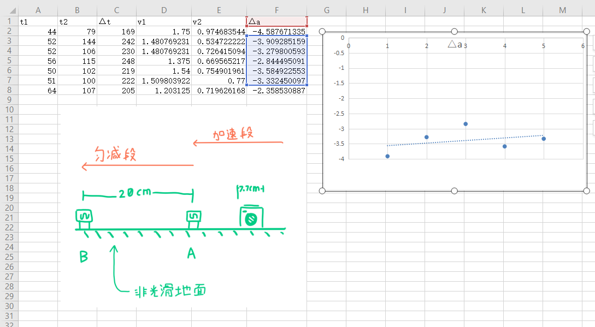

# 附录-1
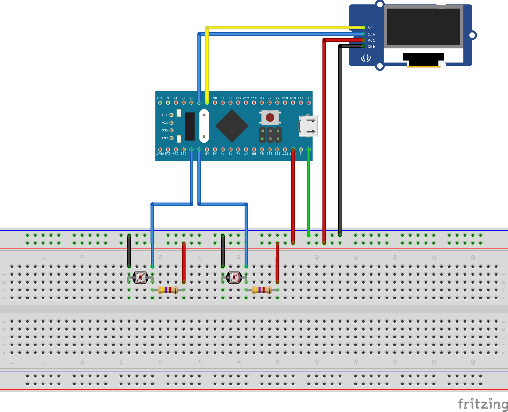

###### 提示:STM32光电门程序后OLED会显示出启动信息，随后自动进行调光，此时请确保将光敏电阻置于实验环境下，当调光结束后OLED会显示两张启动画面中的一张譬如：
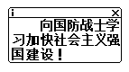
###### 则表明调光程序已自动完成，如果光照条件改变，请务必按下复位按钮重新调光！启动画面结束后随后进入操作界面，并且光电门时有顺序之分的，可以根据附带的接线图所示，光电门A连接到单片机的A0,光电门B连接到单片机的A1。进行试验时确保被测物先通过光电门A再通过光电门B，并且确保两光电门之间保持合适距离，确保收集到准确的实验数据！

# 附录-2
WINDOWS上位机软件所在目录
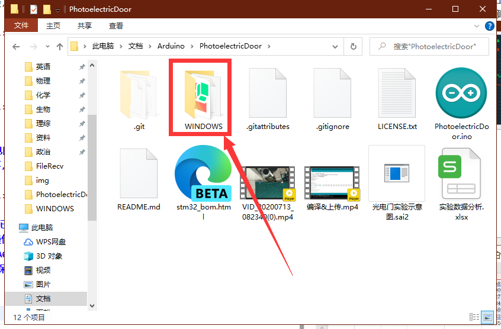
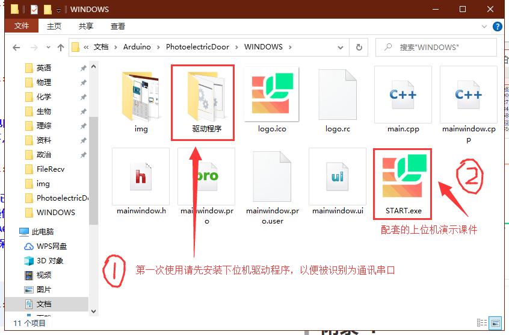
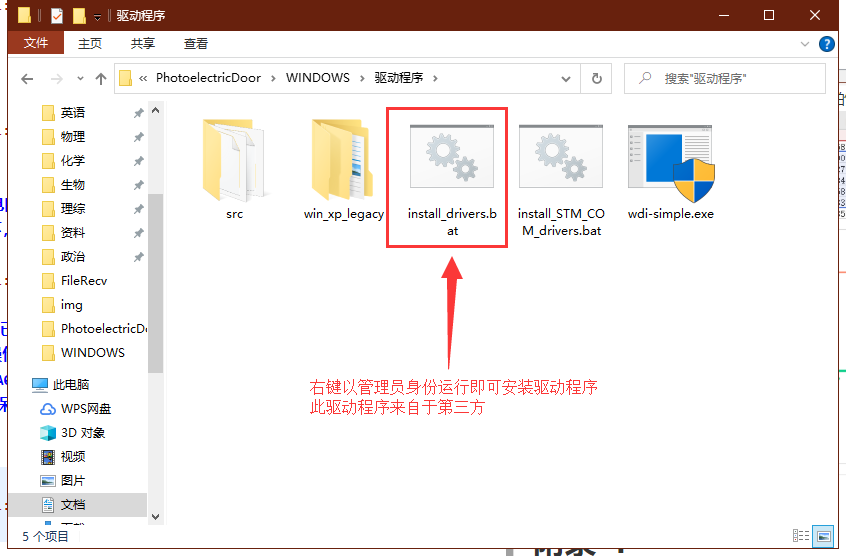
上位机软件操作
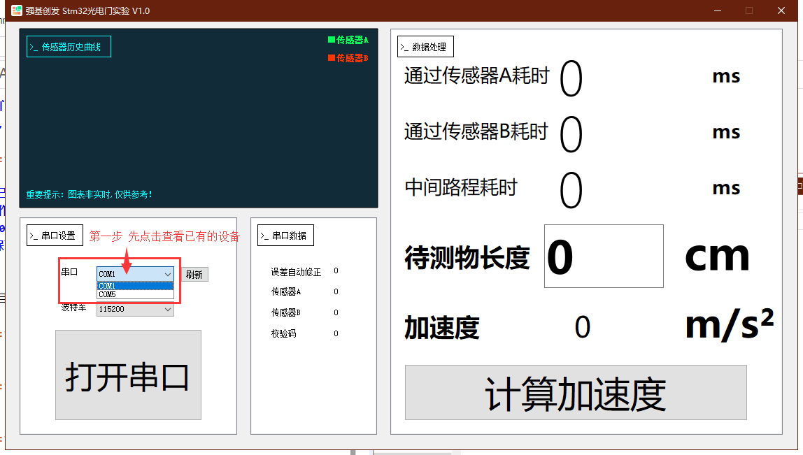
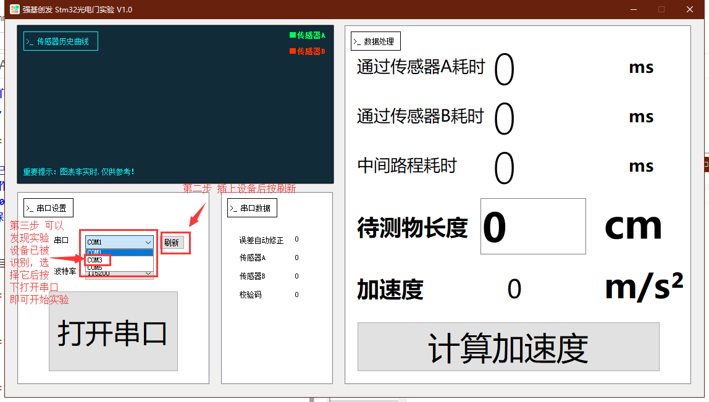
望各位老师使用愉快！若遇到问题可以发邮件到createskyblue@outlook.com